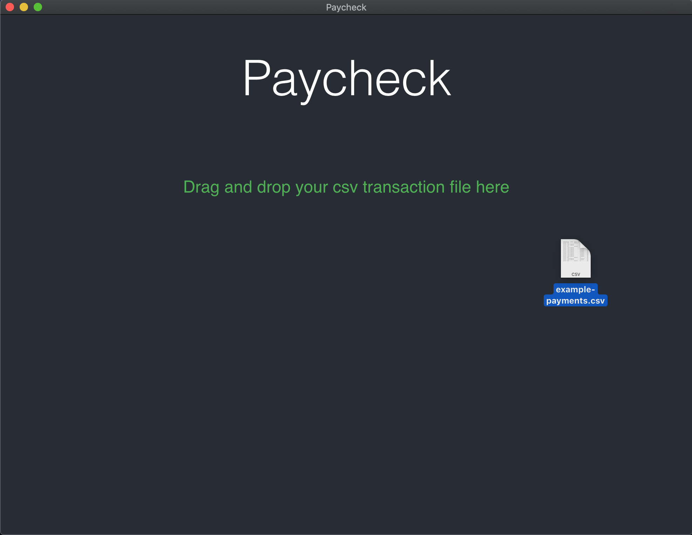
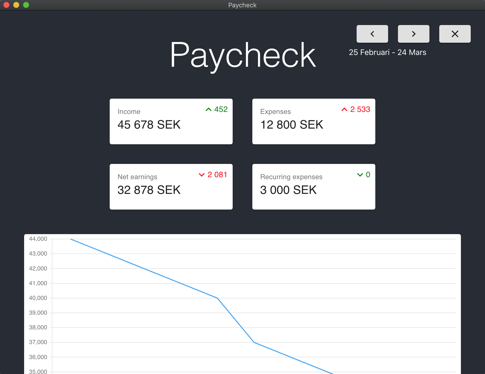

# Paycheck
An electron app that visualizes where your paycheck goes. Built for myself, so only handles Nordea transaction files in Swedish but could easily be altered. 

See revenue and costs, compare between months and see recurring costs.

React app built on react-scripts in typescript using material ui.

## Run locally

Install dependencies
```
yarn
```

Start project (will open a browser)
```
yarn start
```

Build production app
```
yarn build
```

## Screenshots
**Initial state**

**Hovering file**

**Loaded with example data**

